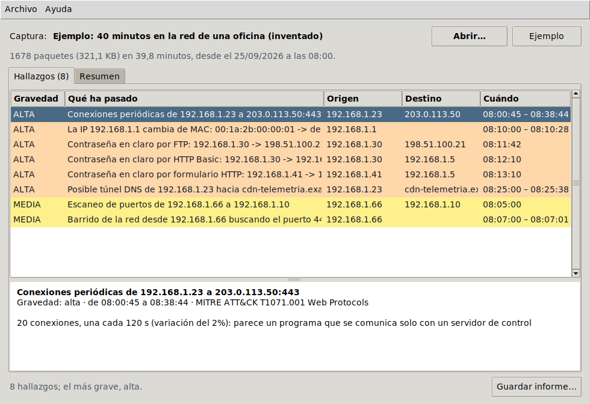

# pcap-hunter

[](https://github.com/espi0207/pcap-hunter/actions/workflows/ci.yml)
[](https://github.com/espi0207/pcap-hunter/actions/workflows/release.yml)

Analiza capturas de red (`.pcap` y `.pcapng`, las de tcpdump y Wireshark) y busca
señales de ataque: escaneos de puertos, ARP spoofing, túneles DNS para sacar datos,
malware que "llama a casa" a intervalos regulares y contraseñas que viajan sin cifrar.

Lo interesante es que no usa scapy ni dpkt: el formato de los archivos y cada capa de
los paquetes (Ethernet, ARP, IPv4, IPv6, TCP, UDP, DNS) se leen a mano con `struct`,
siguiendo los RFC. Lo hice así para entender de verdad qué hay dentro de un paquete.



## Descargar

| Sistema | |
|---|---|
| **Windows** 10 y 11 | [Instalador (pcap-hunter-windows.exe)](https://github.com/espi0207/pcap-hunter/releases/latest/download/pcap-hunter-windows.exe) |
| **macOS** 11 o posterior, con chip de Apple | [pcap-hunter-mac.dmg](https://github.com/espi0207/pcap-hunter/releases/latest/download/pcap-hunter-mac.dmg) |
| **Linux** (Ubuntu, Debian, Mint...) | [pcap-hunter-linux.deb](https://github.com/espi0207/pcap-hunter/releases/latest/download/pcap-hunter-linux.deb) |

No están firmados, porque firmar cuesta dinero cada año. Por eso la primera vez el
sistema avisa:

- **Windows** dice "Windows protegió su PC". Pulsa *Más información* y luego *Ejecutar
  de todas formas*. El instalador puede añadir pcap-hunter a *Abrir con* en los
  archivos .pcap y .pcapng, sin quitarle las capturas a Wireshark.
- **macOS**: arrastra pcap-hunter a Aplicaciones y ábrelo. Dirá que no puede comprobar
  si es seguro; ve a *Ajustes del Sistema > Privacidad y seguridad*, baja hasta el
  aviso de pcap-hunter y pulsa *Abrir igualmente*. Solo hace falta una vez.
- **Linux**: `sudo apt install ./pcap-hunter-linux.deb`. Sale en *Abrir con* de las
  capturas, e instala también la versión de terminal (`pcaphunter`).

Para verlo funcionar: *Archivo > Abrir la captura de ejemplo* (40 minutos inventados
en la red de una oficina, con varios ataques dentro).

Los tres se construyen y se prueban en GitHub Actions: la CI instala cada uno, lo abre
con el ejemplo y comprueba que encuentra lo que tiene que encontrar.

## Instalación (para la terminal)

Python 3.10 o superior, sin dependencias.

```bash
git clone https://github.com/espi0207/pcap-hunter.git
cd pcap-hunter
python -m venv .venv
source .venv/bin/activate        # en Windows: .venv\Scripts\activate
pip install -e .
```

## Probarlo

En `samples/oficina.pcap` hay 40 minutos de tráfico inventado de una oficina pequeña,
con varios ataques mezclados entre la navegación normal. Se puede abrir también en
Wireshark para comparar.

```bash
pcaphunter samples/oficina.pcap
```

```text
pcap-hunter: samples/oficina.pcap
2026-09-25 10:00:01 (hora local), 39.8 minutos de tráfico
1678 paquetes (321.1 KB): TCP 1252, UDP 374, ARP 52

[ALTA]    Conexiones periódicas de 192.168.1.23 a 203.0.113.50:443
          10:00:45 -> 10:38:44  (T1071.001 Web Protocols)
          20 conexiones, una cada 120 s (variación del 2%): parece un programa que se comunica solo con un servidor de control

[ALTA]    La IP 192.168.1.1 cambia de MAC: 00:1a:2b:00:00:01 -> de:ad:be:ef:00:66
          10:10:00 -> 10:10:28  (T1557.002 ARP Cache Poisoning)
          45 paquete(s) ARP; la MAC de:ad:be:ef:00:66 es la de 192.168.1.66: ese equipo se está haciendo pasar por 192.168.1.1

[ALTA]    Contraseña en claro por FTP: 192.168.1.30 -> 198.51.100.21:21
          10:11:42  (T1040 Network Sniffing)
          usuario 'jgarcia', contraseña V… (11 caracteres). Cualquiera en la misma red puede leerla

[ALTA]    Posible túnel DNS de 192.168.1.23 hacia cdn-telemetria.example
          10:25:00 -> 10:25:38  (T1071.004 Application Layer Protocol: DNS)
          80 subdominios distintos de 51 caracteres de media y entropía 5.0; unos 4.0 KB codificados en los nombres; tipos: TXT (80)

[MEDIA]   Escaneo de puertos de 192.168.1.66 a 192.168.1.10
          10:05:00  (T1046 Network Service Discovery)
          40 puertos distintos en menos de un segundo; abiertos: 22, 80, 443, 445. Escaneo SYN, medio abierto (como nmap -sS)
...
```

La historia completa de esa captura: el equipo `.66` escanea el servidor y la red
buscando SMB, se hace pasar por el router con ARP spoofing, y mientras tanto el `.23`
está infectado, se comunica con su servidor de control cada dos minutos y acaba sacando
un archivo por DNS. Hay además tres contraseñas que viajan en claro (FTP, una intranet
con autenticación Basic y un formulario). El script que la genera está en
`samples/generate_sample.py`.

Con `--format json` la salida sale en JSON. El programa acaba con código 1 si encuentra
algo de prioridad alta.

### Con una captura tuya

```bash
sudo tcpdump -i eth0 -w captura.pcap        # Ctrl-C para parar
pcaphunter captura.pcap
```

O desde Wireshark, *Archivo > Guardar como*. Solo en redes tuyas o en las que tengas
permiso: capturar el tráfico de otros sin autorización es delito.

## Qué detecta

| Regla | Qué mira | MITRE ATT&CK |
|---|---|---|
| Escaneo de puertos | Un equipo manda SYN a 15 puertos o más de otro en un minuto. Dice qué puertos respondieron abiertos y si el escaneo completa las conexiones (`nmap -sT`) o las corta con RST (`nmap -sS`) | T1046 |
| Barrido de la red | El mismo puerto probado en 15 equipos o más, o pings a 15 equipos | T1046, T1018 |
| ARP spoofing | Una IP que pasa a responder desde otra MAC. Si esa MAC ya era de otro equipo de la red, alguien se está haciendo pasar por esa IP | T1557.002 |
| Túnel DNS | 20 subdominios distintos o más bajo un mismo dominio, largos o con pinta aleatoria (entropía alta). Así funcionan dnscat2 o iodine | T1071.004 |
| Beaconing | 6 conexiones o más al mismo destino a intervalos casi exactos. Se mide la dispersión de los intervalos, porque el malware suele añadir algo de variación para disimular | T1071 |
| Credenciales en claro | HTTP Basic y Bearer, formularios de login por HTTP, FTP, POP3, IMAP y SMTP (AUTH PLAIN y AUTH LOGIN). Las contraseñas no se imprimen enteras | T1040 |

Los umbrales están en `Config`, en `pcaphunter/detectors.py`.

## Cómo funciona

```text
pcaphunter/
├── pcapfile.py    lectura de pcap y pcapng (y escritura de pcap)
├── decode.py      Ethernet/VLAN/Linux cooked -> ARP, IPv4, IPv6 -> TCP, UDP, ICMP -> DNS
├── creds.py       credenciales en claro, con estado por conexión (USER y PASS van por separado)
├── detectors.py   las reglas
├── analysis.py    lo junta todo y saca estadísticas
├── craft.py       construir paquetes byte a byte (para el ejemplo y las pruebas)
└── __main__.py    línea de comandos
```

Algunos detalles:

- **pcap y pcapng en cualquier orden de bytes.** El número mágico del principio dice si
  el archivo es little o big endian y si la hora va en micro o nanosegundos. En pcapng
  cada interfaz puede tener su propia resolución de tiempo (`if_tsresol`).
- **DNS con compresión de nombres.** Los nombres de las respuestas suelen ser punteros a
  otra parte del mensaje (RFC 1035, 4.1.4). Un paquete malicioso puede tener punteros
  en bucle, así que se limita el número de saltos.
- **Ventana deslizante para los escaneos**, igual que en log-sentinel: se cuenta el
  máximo de puertos distintos dentro de cualquier minuto, no en minutos fijos.
- **Cada respuesta se asocia a su conexión exacta** (IPs y los dos puertos). Si no, un
  SYN-ACK de otra conexión haría parecer abierto un puerto que en el escaneo dio cerrado.
- **Nada de lo que viene en la captura se fía.** Si un paquete está mal formado se
  cuenta y se salta. Los nombres de dominio y las contraseñas se escapan antes de
  imprimirlos, por si traen secuencias de terminal.

### Cómo sé que decodifica bien

Aparte de las pruebas, lo comparé con scapy: los 1678 paquetes de la captura de ejemplo
se decodifican igual (IPs, puertos, flags, nombres DNS, ARP) y todos los checksums que
genera `craft.py` son correctos. También leí un pcapng escrito por scapy con VLAN, IPv6
y DNS. Y hay una prueba que corrompe la captura de ejemplo al azar 150 veces para
comprobar que nunca se cae.

## Limitaciones

- No reconstruye los flujos TCP: mira cada paquete por separado. Un login que llegue
  partido en dos segmentos no se ve. Tampoco ve nada dentro de HTTPS, claro.
- El "dominio base" para los túneles DNS es una aproximación (las dos últimas partes, o
  tres en casos como `.co.uk`). Lo exacto necesitaría la Public Suffix List.
- Un cambio de MAC legítimo (cambiar el router) sale como aviso de prioridad media.
- Cualquier cosa periódica parece un beacon: un agente de monitorización que se conecta
  cada 30 segundos también sale. Toca revisar el destino.
- Es Python puro: unos 65.000 paquetes por segundo. Para capturas de gigas, mejor Zeek.

## Pruebas

```bash
pip install -e ".[dev]"
pytest
```

La captura de ejemplo que abre la ventana no va dentro del programa: se genera al
momento con `pcaphunter/sample.py`, y una prueba comprueba que sale idéntica, byte a
byte, a `samples/oficina.pcap`.

La ventana (`pcaphunter/gui.py`) usa Tkinter, que viene con Python, y hace el trabajo
lento en otro hilo para no quedarse congelada. Los instaladores los construye
[`release.yml`](.github/workflows/release.yml) en una máquina de cada sistema:
PyInstaller e Inno Setup para Windows, PyInstaller para la app de macOS y un `.deb` que
usa el Python del sistema para Linux. Con cada cambio se construyen y se prueban. Para
publicarlos en Releases basta con *Actions > Instaladores > Run workflow* marcando
*Publicar* (o subir una etiqueta: `git tag v1.1.0 && git push --tags`).

## Licencia

[MIT](LICENSE)
